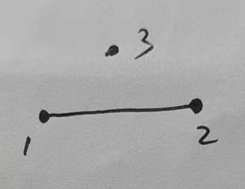

## 论文笔记-基于大型网络数据下的社区发现算法

### 该论文于2004年发表在物理学报上，主要作者有Newman，是其2003年发表的fast algorithm论文的更新版本。这里主要对论文中某些公式进行相应证明和思路解析。

### 1.论文首先提出了最初的**目标函数**：

$$
\frac{\sum_{vw}{A_{vw}}\delta \left( c_v,c_w \right)}{\sum_{vw}{A_{vw}}}=\frac{1}{2m}\sum_{vw}{A_{vw}}\delta \left( c_v,c_w \right) 
$$ 其中有： $$
\delta \left( c_v,c_w \right) =\begin{cases}
    1 , c_v=c_w\\
    0 , otherwise\\
\end{cases}
$$ 这个公式的含义是全部社区内部边的2倍占总的节点度之和的比例，它用来衡量整个网络社区划分的好坏。其值越高说明社区内部边越密集，社区外即社区之间的连边越稀疏；这说明我们的划分越好越理想。

但是它有一个[缺点]{.ul}是：当所有的节点同属于一个社区的时候，其值为1.这导致了任何社区划分下的目标函数的取值都没法超越它。因此这个衡量方式就有问题存在。显然1个社区的划分并不是我们想要的结果。

### 2.对目标函数进行修正-模块度 {style="blue"}

在原来提出的目标函数上，论文提出了一个节点对之间存边的概率期望：

$$
\frac{k_vk_w}{2m}
$$

它的构造基于整个网络数据中节点边的连接是随机产生的。

我们给出它的proof，引入2个示性函数：

$$
I_{i}^{\left( v,w \right)}=\begin{cases}	1 , ith\text{与节点}w\text{相连}\\	0 , otherwise\\\end{cases}
$$

以及

$$
J_{\left( v,w \right)}=\begin{cases}	1 , \text{节点}v\text{与节点}w\text{相连}\\	0 \text{，} otherwise\\\end{cases}
$$

那么易想到节点v的ith边与节点w相连的组合共有节点w度那么多，而ith与所有节点相连的组合共有2m，则有：

$$
P\left( I_{i}^{\left( v,w \right)}=1 \right) =\frac{k_w}{2m}\,\,; 2m=k_1+k_2+\cdots +k_{all}
$$

因此有：

$$
P\left( J_{\left( v,w \right)}=1 \right) =\sum_i{P\left( I_{i}^{\left( v,w \right)}=1 \right)}=\sum_i^{k_v}{\frac{k_w}{2m}}=\frac{k_vk_w}{2m}
$$

有了上述的概率期望，我们给出修正的目标函数-模块度Q：

$$
Q=\frac{1}{2m}\sum_{vw}{\left[ A_{vw}-\frac{k_vk_w}{2m} \right]}\delta \left( c_v,c_w \right) =\sum_i{\left( e_{ii}-a_{i}^{2} \right)}
$$

其中模块度的取值范围为[-1/2,1); Q越高说明我们的社区划分越理想。

上面公式定义有定义了3个式子：

1.节点度：$k_v=\sum_w{A_{vw}}$

2.社区间连边占总度和比例：$e_{ij}=\frac{1}{2m}\sum_{vw}{A_{vw}}\delta \left( c_v,i \right) \delta \left( c_w,j \right)$

3.社区内部节点度和占总度和比例：$a_i=\frac{1}{2m}\sum_v{k_v}\delta \left( c_v,i \right)$

我们给出取值范围的证明：首先是下限-1/2；这是基于考虑到网络中每个节点的度达到最大时的情况，有以下的社区邻接矩阵：

$$
e=\left( \begin{matrix}{}	0&		1&		\cdots&		1\\	1&		0&		\cdots&		1\\	\vdots&		1&		\ddots&		\vdots\\	1&		1&		\cdots&		0\\\end{matrix} \right) _{n\times n}
$$

此时的2m=n(n-1) ; $a_i$= $\frac{n-1}{n\left( n-1 \right)}$ .有：$Q=\sum_i{\left( e_{ii}-a_{i}^{2} \right)}=0-\left( \frac{n-1}{n\left( n-1 \right)} \right) ^2\times n=-\frac{1}{n}\geqslant -\frac{1}{2}\,\,; n\geqslant 2$

针对上限情况，考虑如下社区：

$$
\begin{array}{c}	\bullet\\	\updownarrow\\	\bullet\\	1\\\end{array}\begin{array}{c}	\bullet\\	\updownarrow\\	\bullet\\	2\\\end{array}\cdots \begin{array}{c}	\bullet\\	\updownarrow\\	\bullet\\	n\\\end{array}
$$

那么它的邻接矩阵为：

$$
e=\left[ \begin{matrix}{}	2&		0&		\cdots&		0\\	0&		2&		\cdots&		0\\	\vdots&		0&		\ddots&		\vdots\\	0&		0&		\cdots&		2\\\end{matrix} \right] _{n\times n}
$$

因此有： $Q=\frac{2}{2n}\times n-\left( \frac{2}{2n} \right) ^2\times n=1-\frac{1}{n}<1$

### 3.由邻接矩阵给出最初算法的实现

.png){width=200px height=100px}

给出上面例子的邻接矩阵$A_{ij}^{'}=2me_{ij}$

$$
e=\left[ \begin{matrix}{}	6&		1&		0&		0\\	1&		0&		1&		1\\	0&		1&		0&		1\\	0&		1&		1&		0\\\end{matrix} \right]
$$

于是计算$Q=\frac{6}{2\times 7}+0-\left( \frac{7}{2\times 7} \right) ^2-2\times \left( \frac{2}{2\times 7} \right) ^2-\left( \frac{3}{2\times 7} \right) ^2=0.0918367$

假设社区1和社区2合并，邻接矩阵改为：

$$
e=\left[ \begin{matrix}{}	8&		1&		1\\	1&		0&		1\\	1&		1&		0\\\end{matrix} \right]
$$

运用相同的算法可以求出Q值。

### 4.最后是本文的最新算法$\varDelta Q$

论文最初设定，把每一个节点单独的看作一个社区开始合并，这样给出最开始的公式：

$$
\Delta Q_{ij}=\begin{cases}	1/2m-k_ik_j/(2m)^2&		\,\,\mathrm{if} i,j\,\,\mathrm{are} \mathrm{connected}\\	0&		\,\,\mathrm{otherwise}\\\end{cases}
$$

这个公式实际上是对2003年论文中的$\Delta Q_{ij}$进行了修正。实际上的$\Delta Q_{ij}$为：

$\varDelta Q=2\left( e_{ij}-a_ia_j \right)$

给出其证明：

首先假设共有n个社区，我们合并1社区和2社区并记为t社区，因此合并前的Q为：

$$
Q=\sum_{i=1}^n{\left( e_{ii}-a_{i}^{2} \right) =\sum_{j=1}^2{\left( e_{jj}-a_{j}^{2} \right) +\sum_{i=3}^n{\left( e_{ii}-a_{i}^{2} \right)}}}
$$

合并后的Q为：

$$
Q'=\left( e_{tt}-a_{t}^{2} \right) +\sum_{i=3}^n{\left( e_{ii}-a_{i}^{2} \right)}
$$

因此2者做差得到$\varDelta Q$:

$$
\varDelta Q_{12}=Q'-Q=\left( e_{tt}-a_{t}^{2} \right) -\sum_{j=1}^2{\left( e_{jj}-a_{j}^{2} \right)}
$$

其中易知道$e_{tt}=e_{11}+e_{22}+2e_{12}$以及$a_t=a_1+a_2$带入上式即证。

最后再证论文中假设社区i和社区j合并后，社区k再与合并社区进行合并的对应$\varDelta Q$。

设i与j社区合并后记为社区t，那么有：

1.k社区同时与i，j社区相连：

$$
\varDelta Q_{kt}=\varDelta Q_{ik}+\varDelta Q_{jk}
$$

实际上

$$
\,\,e_{kt}=e_{ki}+e_{kj}\,\,; a_t=a_i+a_j\\\varDelta Q_{kt}=2e_{kt}-2a_ka_t\,\,=2e_{ki}+2e_{kj}-2a_k\left( a_i+a_j \right) \\=2\left( e_{ki}-a_ka_i \right) +2\left( e_{kj}-a_ka_j \right) =\varDelta Q_{ki}+\varDelta Q_{kj}\\
$$

2.假设k社区与i社区相连但不与j社区相连，实际上依照1的证明我们有：

$$
e_{kj}=0\\\varDelta Q_{kt}=\varDelta Q_{ki}+\varDelta Q_{kj}=\varDelta Q_{ki}+2\left( e_{kj}-a_ka_j \right) =\varDelta Q_{ki}-2a_ka_j\\
$$

为了便于理解，我们给出一个具体的示例：

{width=200px height=100px}

先算最初的Q值，其有邻接矩阵

$$
\left[ \begin{matrix}{}	0&		1&		0\\	1&		0&		0\\	0&		0&		0\\\end{matrix} \right] _{3\times 3}
$$

所以$Q_0=0-2\times \left( \frac{1}{2} \right) ^2=-0.5\,\,; 2m=2$

按照论文约定给出$\varDelta Q$矩阵：

$$
\varDelta Q_0=\left[ \begin{matrix}{}	0&		\frac{1}{4}&		0\\	\frac{1}{4}&		0&		0\\	0&		0&		0\\\end{matrix} \right]
$$

由于矩阵是对角元素全为0的对称矩阵，则只要计算右上角元素即可。矩阵元素计算如下：

1.$\varDelta Q_{12}=e_{12}-a_1a_2=\frac{1}{2}-\frac{1}{2}\times \frac{1}{2}=0.25$

2.$\varDelta Q_{13}=0$

3.$\varDelta Q_{23}=0$

我们更新Q有：$Q_1=Q_0+\varDelta Q=-0.5+\frac{1}{4}=-0.25$

因为$\varDelta Q$矩阵每行最大值存于的max-heap（最大堆）中的最大值为社区1和社区2合并下的0.25。所以接着更新$\varDelta Q$矩阵：

$$
\varDelta Q_1=\left[ \begin{matrix}{}	0&		0\\	0&		0\\\end{matrix} \right]
$$

$\varDelta Q$矩阵最后只能更新到2\*2矩阵就结束。这里由于$\varDelta Q_{1'3}=0$所以仅仅合并社区1和社区2已经是最优划分了。
