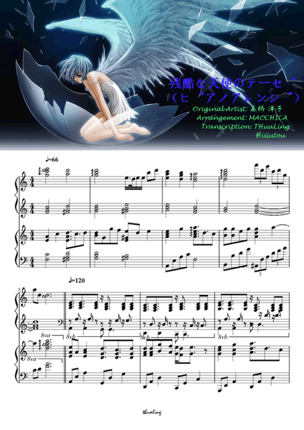

#### 用R实现残酷な天使のテーゼ的钢琴曲演奏，时长1min左右。
#### 曲谱来源：http://qupu.pingguodj.com/article/287318.html
#### 原唱为：高桥洋子
#### Cover：LM


```{r echo =FALSE,message=FALSE,warning=FALSE}
library(bubblyr)
library(shiny)
ui <- fluidPage(

    bubbly(theme = "bigmom")

)
ui
```


```{r message=FALSE,warning=FALSE}
library(gm)
#part1
#p11
p111 = list('C4','E4','F4','E4','E4','F4') #pitches
p112 = list(1,1,1.5/2,1/4,1/2,1/2) #durations
p113 = list(4) #tie

#p12
p121 = list('F4','B4','A4','G4','F4','G4','G4')
p122 =list(1,0.5,0.5,0.25,0.5,0.25,1)
p123 = list(12)

#p13
p131 = list('G4','B4','C5','F4','F4','E4')
p132 = list(1,1,1.5/2,1/4,1/2,1/2)
p133 = list(17)

#p21
p211 = list('B4','G4','B4',c('G4','B4'),c('A4','C5'),c('A4','C5'))
p212 = list(1,1/2,1/2,1.5/2,1/4,1)
p213 = list(24)

#p22
p221 = list(NA)
p222 = list(4)

#p23
p231 = list(c('C4','G3'),c('E4','G3'),c('F4','C4'),'D4','D4',c('F4','C4'))
p232 = list(1,1,1.5/2,1/4,1/2,1/2)
p233 = list(30)

#p31
p311 = list(c('B3','F4'),c('F4','D4'),c('F4','D4','B4'),'A4',
            c('G4','B3'),'F4',c('G4','B3'),'G4')
p312 = list(1/2,1/2,1/2,1/2,1/4,1/2,1/4,1)
p313 = list(39)

#p32
p321 = list(c('C4','E4','G4'),c('E4','G4','B4'),c('F4','A4','C5'),
            'F4','F4','E4')
p322 = list(1,1,1.5/2,1/4,1/2,1/2)
p323 = list(44)

#p33
p331 = list(c('D4','B4'),c('D4','B4'),c('G4','B3'),c('B4','E4'),
            c('B4','E4'),c('C5','E4'),c('C5','E4'))
p332 = list(1/2,1/2,1/2,1/2,1.5/2,1/4,1)
p333 = list(52)

#p41
p411 = list(c('E4','B3','G3'),'E5','B4','B4','B4','E5')
p412 = list(1,1/2,1/4,1/4,1.5,1/2)
p413 = list(57)
pitches1 = c(p111,p121,p131,p211,p221,p231,p311,p321,p331,p411)
durations1 = c(p112,p122,p132,p212,p222,p232,p312,p322,p332,p412) 
tie1 = c(p113,p123,p133,p213,p233,p313,p323,p333,p413)

#part2
#p42
p421 = list('E5','F5','F5','B4','B4','B4')
p422 = list(1.5/2,1/4,1/2,1/2,1.5,1/2)
p423 = list(61)
#p43
p431 = list('G5','A5','A5','G5','F5','E5','E5','F5')
p432 = list(1.5/2,1/4,1/2,1/2,1.5/2,1/4,1/2,1/2)
p433 = list(67,71)
#p51
p511 = list('G5','A5','A5','G5','C5','C5','D5')
p512 = list(0.75,0.25,0.5,0.5,1.5,0.25,0.25)
p513 = list(75)
#p52
p521 = list('E5','E5','E5','D5','D5','E5','F5')
p522 = list(0.75,0.25,0.5,0.5,1.5,0.25,0.25)
p523 = list(82)
#p53
p531 = list('A5','G5','G5','F5','E5','G5')
p532 = list(0.75,0.25,0.5,0.5,1.5,0.5)
p533 = list(89)
#p61
p611 = list('G5','F5','F5','E5','F5','C5')
p612 = list(0.75,0.25,0.5,0.5,1,1)
p613 = list(95)
#p62
p621 = list(c('C5','G4','D4'),'D5',c('D5','B4','G4'))
p622 = list(1.5,0.5,2)
#p63
p631 = list(c('B4','E4','G4','B3'),'E5','B4','B4','B4','E5')
p632 = list(1,1/2,1/4,1/4,1.5,1/2)
p633 = list(106)
#p71
p711 = list(c('E5','B4','E4'),'F5','F5','B4',c('B4','F4','D4'),c('C5','A4'))
p712 = list(1.5/2,1/4,1/2,1/2,1,1)
p713 = list(110)
#p72
p721 = list(c('G5','C5','G4'),'A5','A5','G5',c('F5','D5','B4'),'E5','E5','F5')
p722 = list(1.5/2,1/4,1/2,1/2,1.5/2,1/4,1/2,1/2)
p723 = list(116,120)

pitches2 = c(p421,p431,p511,p521,p531,p611,p621,p631,p711,p721)
durations2 = c(p422,p432,p512,p522,p532,p612,p622,p632,p712,p722)
tie2 = c(p423,p433,p513,p523,p533,p613,p633,p713,p723)

#part3
#p73
p731 = list(c('G5','C5'),'A5','A5','G5','C5','C5','D5')
p732 = list(1.5/2,1/4,1/2,1/2,1.5,1/4,1/4)
p733 = list(124)
#p81
p811 = list(c('E5','B4','F4'),'E5','E5','D5',c('D5','B4','F4'),'E5','F5')
p812 = list(1.5/2,1/4,1/2,1/2,1.5,1/4,1/4)
p813 = list(131)
#p82

pitches3 = c(p731,p811)
durations3 = c(p732,p812)
tie3 = c(p733,p813)

#低音部分-F-q;qabc中a是段,b是节。#
#part1
#q11
q111 = list(c('G3','E3','C3'),c('F3','A3','C4'))
q112 = list(2,2)
#q12
q121 = list(c('B2','D3','F3'),c('E3','G3','B3'))
q122 = list(2,2)
#q13
q131 = list(c('G3','E3','C3'),c('F3','A3','C4'))
q132 = list(2,2)
#q21
q211 = list(c('G3','B3','D4'),c('A3','C4','E4'))
q212 = list(2,2)
#q22
q221 = list(NA,'G3','D3','D3','G2')
q222 = list(2,1.5/2,1/4,1/2,1/2)
q223 = list(11)
#q23
q231 = list(c('C3','C2'),'C2','C3','E3',c('F3','F2'),'F3','F3',c('F3','F2'),'C2')
q232 = list(1/2,1/2,1/2,1/2,1/4,1/4,1/2,1/2,1/2)
#q31
q311 = list(c('B1','B2'),'B2',c('D2','D3'),'D3',c('E3','E2'),'E3','E3','D3')
q312 = as.list(rep(1/2,8))
#q32
q321 = list(c('C3','C2'),'C3',c('C3','C2'),'E3',c('F2','F3'),'F3',c('F3','F2'),c('C3','C2'))
q322 = as.list(rep(1/2,8))
#q33
q331 = list(c('B2','B1'),c('B2','B1'),c('B2','B1'),c('C3','C2'),c('C3','C2'),c('C3','C2'),
            c('B2','B1'),c('B2','B1'))
q332 = as.list(rep(1/2,8))
#q41
q411 = list(c('E3','E2'),'E3','E2',c('E3','E2'),c('E3','E2'),'E3','E2','E3')
q412 = as.list(rep(1/2,8))

pitches11 = c(q111,q121,q131,q211,q221,q231,q311,q321,q331,q411)
durations11 = c(q112,q122,q132,q212,q222,q232,q312,q322,q332,q412)
tie11 = c(q223)

#part2
#q42
q421 = list(c('B2','B1'),'B2','B1',c('B2','B1'),c('B2','B1'),'B2','B1','B2')
q422 = as.list(rep(1/2,8))
#q43
q431 = list(c('C3','C2'),'C3','C2',c('C3','C2'),c('C3','C2'),'C3','C2','C3')
q432 = as.list(rep(1/2,8))
#q51
q511 = list(c('A2','A1'),'A2','A1',c('A2','A1'),c('A2','A1'),'A2','A1','A2')
q512 = as.list(rep(0.5,8))
#q52
q521 = list(c('B2','B1'),'B2','B1',c('B2','B1'),c('B2','B1'),'B2','B1','B2')
q522 = as.list(rep(0.5,8))
#q53
q531 = list(c('E3','E2'),'E3','E2','E3',c('C3','C2'),'C3','C2','C3')
q532 = as.list(rep(0.5,8))
#q61
q611 = list(c('D3','D2'),'D3','D2',c('D3','D2'),c('D3','D2'),'D3','D2','D3')
q612 = as.list(rep(0.5,8))
#q62
q621 = list(c('G3','G2'),'G3','G2',c('G3','G2'),c('G3','G2'),'G3','G2','G3')
q622 = as.list(rep(0.5,8))
#q63
q631 = list(c('E3','E2'),'E3','E2','E3',c('E3','E2'),'E3','E2','E3')
q632 = as.list(rep(1/2,8))
#q71
q711 = list(c('B2','B1'),'B2','B1',c('B2','B1'),c('B2','B1'),'B2','B1','B2')
q712 = as.list(rep(1/2,8))
#q72
q721 = list(c('C3','C2'),'C3','C2',c('C2','C3'),c('B2','B1'),'B2','B1','B2')
q722 = as.list(rep(1/2,8))

pitches22 = c(q421,q431,q511,q521,q531,q611,q621,q631,q711,q721)
durations22 = c(q422,q432,q512,q522,q532,q612,q622,q632,q712,q722)

#part3
#q73
q731 = list(c('A2','A1'),'A2','A1',c('A2','A1'),c('A2','A1'),'A2','A1','A2')
q732 = as.list(rep(1/2,8))
#q81
q811 = list(c('B2','B1'),'B2','B1',c('B2','B1'),c('B2','B1'),'B2','B1','B2')
q812 = as.list(rep(1/2,8))

pitches33 = c(q731,q811)
durations33 = c(q732,q812)
#运行#
song = 
  Music()+
  Meter(4,4)+
  Key(-3)+
  Tempo(85)+
  Line(c(pitches1,pitches2,pitches3),
       c(durations1,durations2,durations3),
       c(tie1,tie2,tie3))+
  Line(c(pitches11,pitches22,pitches33),
       c(durations11,durations22,durations33),
       c(tie11))+Clef("G",to=1)
  


show(song,to=c('score','audio'))

```

