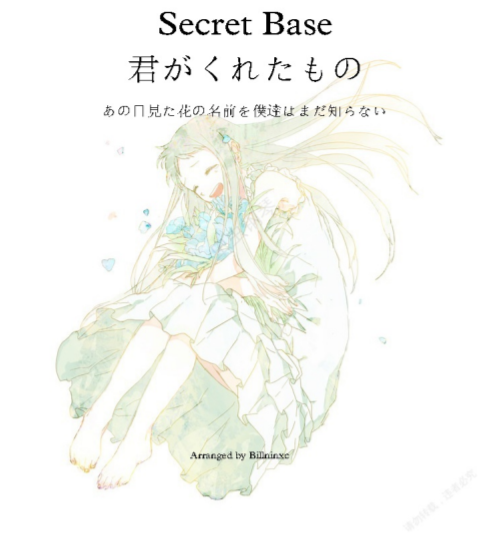

<div class="snowflakes" aria-hidden="true">
  <div class="snowflake">
  ❅
  </div>
  <div class="snowflake">
  ❅
  </div>
  <div class="snowflake">
  ❆
  </div>
  <div class="snowflake">
  ❄
  </div>
  <div class="snowflake">
  ❅
  </div>
  <div class="snowflake">
  ❆
  </div>
  <div class="snowflake">
  ❄
  </div>
  <div class="snowflake">
  ❅
  </div>
  <div class="snowflake">
  ❆
  </div>
  <div class="snowflake">
  ❄
  </div>
</div>


```{css echo = FALSE}
/*Source: https://codepen.io/codeconvey/pen/xRzQay*/
  
/* customizable snowflake styling */
.snowflake {
  color: lightblue;
  font-size: 2em;
  font-family: Arial;
  text-shadow: 0 0 1px #000;
}

@-webkit-keyframes snowflakes-fall{0%{top:-10%}100%{top:100%}}
@-webkit-keyframes snowflakes-shake{
    0%{-webkit-transform:translateX(0px);transform:translateX(0px)}
   50%{-webkit-transform:translateX(80px);transform:translateX(80px)}
  100%{-webkit-transform:translateX(0px);transform:translateX(0px)}}
@keyframes snowflakes-fall{
    0%{top:-10%}
  100%{top:100%}}
@keyframes snowflakes-shake{
    0%{transform:translateX(0px)}
   50%{transform:translateX(80px)}
  100%{transform:translateX(0px)}}

.snowflake{
  position:fixed;
  top:-10%;
  z-index:9999;
  -webkit-user-select:none;
  -moz-user-select:none;
  -ms-user-select:none;
  user-select:none;
  cursor:default;
  -webkit-animation-name:snowflakes-fall,snowflakes-shake;
  -webkit-animation-duration:15s,6s;
  -webkit-animation-timing-function:linear,ease-in-out;
  -webkit-animation-iteration-count:infinite,infinite;
  -webkit-animation-play-state:running,running;
  animation-name:snowflakes-fall,snowflakes-shake;
  animation-duration:15s,6s;
  animation-timing-function:linear,ease-in-out;
  animation-iteration-count:infinite,infinite;
  animation-play-state:running,running}

.snowflake:nth-of-type(0){left: 1%;-webkit-animation-delay:  0s,  0s;animation-delay:  0s,  0s}
.snowflake:nth-of-type(1){left:10%;-webkit-animation-delay:  1s,  1s;animation-delay:  1s,  1s}
.snowflake:nth-of-type(2){left:20%;-webkit-animation-delay:  6s,0.5s;animation-delay:  6s,0.5s}
.snowflake:nth-of-type(3){left:30%;-webkit-animation-delay:  4s,  2s;animation-delay:  4s,  2s}
.snowflake:nth-of-type(4){left:40%;-webkit-animation-delay:  2s,  2s;animation-delay:  2s,  2s}
.snowflake:nth-of-type(5){left:50%;-webkit-animation-delay:  8s,  3s;animation-delay:  8s,  3s}
.snowflake:nth-of-type(6){left:60%;-webkit-animation-delay:  6s,  2s;animation-delay:  6s,  2s}
.snowflake:nth-of-type(7){left:70%;-webkit-animation-delay:2.5s,  1s;animation-delay:2.5s,  1s}
.snowflake:nth-of-type(8){left:80%;-webkit-animation-delay:  1s,  0s;animation-delay:  1s,  0s}
.snowflake:nth-of-type(9){left:90%;-webkit-animation-delay:  3s,1.5s;animation-delay:  3s,1.5s}
```


```{r echo=FALSE,message=FALSE,warning=FALSE}
library(shiny)
library(bubblyr)

#ui <- fluidPage(

    bubbly(theme = "bigmom",color="red")

#)
#ui
```



用R演奏secret base~君がくれたもの<br>
时长2min左右<br>
曲谱来源：https://www.kanpula.com/ganqqinpu/11127.html<br>
Cover：LM<br>


```{r message=FALSE,warning=FALSE}
library(gm)

#secret base~君がくれたもの

#########
#G谱部分#
#########

#part1
g10pit = list(c('B5','E5','C5'),c('B5','F5'),'A5',
             c('B5','E5','C5'),c('B5','F5'),'A5',
             c('B5','E5','C5'),c('B5','F5'),'A5',
             c('G5','B4'),c('G5','B4'),NA,NA,'E5','G5','A5',
             'A5','B5','B5','B5','B5','B5','B5','B5','A5','A5','A5','A5','A5','A5',
             'A5','G5','G5','G5','G5','G5','G5','G5','D5','D5','D5',NA,'D5','G5','A5',
             'B5','B5','B5','B5','B5','B5','B5','D6',NA,'B5','B5','B5','B5','B5','A5','G5',
             'A5','B5','B5',NA,c('D6','G6'),c('B5','D6'),'A5','B5',
             'A5','G5','G5','G5',NA,NA,'A5','B5',
             'A5','G5','G5','G5',c('B5','D6'))
g10dur = list(2,1,1,
              2,1,1,
              2,1,1,
              2,1.5/2,1/4,1/4,1/4,1/4,1/4,
              1/4,1/4,1/4,1/4,1/4,1/2,1/4,1/4,1/4,1/4,1/4,1/4,1/2,1/4,
              1/4,1/4,1/4,1/4,1/4,1/2,1/4,1/4,1/4,1/4,1/4,1/4,1/4,1/4,1/4,
              1/4,1/4,1/4,1/4,1/4,1/4,1/4,1/4,1/4,1/4,1/4,1/4,1/4,1/4,1/4,1/4,
              1/2,1/4,1/4,1,1,1/2,1/4,1/4,
              1/2,1/4,1/4,1,1,1/2,1/4,1/4,
              1/4,1/2,1/4,1,2)
g10tie = list(10,23,30,37,72,80)

#part2
g20pit = list(c('C4','E4','G4','B4'),c('D4','F4','B4'),
              c('D4','G4'),
              'G5','G5','G5','G5','G5','G5','G5','G5','G5','G5','F5','D5','D5','D5',
              'G5','G5','G5','G5','G5','G5','G5','G5','F5','D5','D5',
              'G5','G5','G5','G5','G5','G5','G5','G5','A5','D5','D5','D5','D5','B4',
              'D5','D5','E5','E5','E5',NA,
              'G5','G5','G5','G5','G5','G5','G5','G5','F5','D5','D5','D5',
              'F5','G5','G5','F5','G5','G5','G5','G5','G5','G5','F5','D5','D5',
              'G5','G5','G5','G5','G5','G5','G5','A5','D5','D5','D5','D5','D5','B4',
              'D5','E5','E5','E5',NA)
g20dur = c(list(2,2),
           list(4),
           as.list(rep(1/4,12)),list(1.5/2,1/4),
           as.list(rep(1/4,4)),list(1/2,1/2),as.list(rep(1/4,4)),1,
           as.list(rep(1/4,9)),list(1/2,1/4,1/2,1/4,1/4),
           as.list(rep(1/4,4)),list(1,2),
           as.list(rep(1/4,6)),list(1/2,1/2,1/4,1/4),list(1.5/2,1/4),
           as.list(rep(1/4,12)),list(1),
           as.list(rep(1/4,5)),list(1/2,1/4,1/4,1/2,1/4),as.list(rep(1/4,4)),
           list(1/2,1/4,1/4,1,2))
g20tie = list(97,109,121,128,140,154,165,172)

#part3
g30pit = c(list('E5',NA,'E5','E5','D5','E5'),as.list(rep('F5',7)),
           list('F5'),as.list(rep('G5',4)),list('D5','D5','B4','D5','D5'),as.list(rep('E5',3)),
           list('E5',NA,'E5','E5','D5','E5'),as.list(rep('F5',6)),list('E5'),
           list('F5','F5','G5','G5','G5',NA,'A5','B5'),
           list('A5','G5'),list(c('E5','C5'),c('E5','C5'),'A5','B5','A5','G5','E5','E5','A5','B5'),
           list('A5','G5'),as.list(rep('D5',4)),list('B4','D5'),as.list(rep('E5',3)),list(NA,'B5'),
           list('A5','G5',c('E5','C5'),c('E5','C5'),'A5','B5','A5','G5'),as.list(rep('E5',3)),list(c('C5','A5')),
           list(c('G5','B4'),'D4',NA,'E5','G5','A5'),
           list('A5'),as.list(rep('B5',7)),as.list(rep('A5',6)),
           list('A5'),as.list(rep('G5',7)),as.list(rep('D5',3)),list(NA,'D5','G5','A5'))
g30dur = c(list(1,1/4),as.list(rep(1/4,11)),
           as.list(rep(1/4,12)),list(1),
           list(1),as.list(rep(1/4,12)),
           as.list(rep(1/4,4)),list(2,1/2,1/4,1/4),
           list(1/4,1/2,1/4,1/2),as.list(rep(1/4,3)),list(1/2,1/4,1/2,1/4,1/4),
           list(1/2),as.list(rep(1/4,10)),list(1/2,1/2),
           list(1/4,1/2,1/4,1/2),as.list(rep(1/4,3)),list(1/2),as.list(rep(1/4,3)),list(1/2),
           list(2,1),as.list(rep(1/4,4)),
           as.list(rep(1/4,5)),list(1/2),as.list(rep(1/4,6)),list(1/2,1/4),
           as.list(rep(1/4,5)),list(1/2),as.list(rep(1/4,9)))
g30tie = list(183,191,199,209,217,224,230,236,249,271,285)

#part4
g48pit = c(as.list(rep('B5',7)),list('E6','E6'),as.list(rep('B5',5)),list('A5','G5'),
           list('A5'),as.list(rep('B5',3)),list(NA,'E5','G5','A5'),
           list('A5'),as.list(rep('B5',7)),as.list(rep('A5',3)),list('G5'),as.list(rep('A5',4)),
           list('A5'),as.list(rep('G5',7)),as.list(rep('D5',3)),list(NA,NA,'A5','B5'),
           list('A5'),as.list(rep('B5',6)),as.list(rep('D6',2)),as.list(rep('B5',5)),list('A5','G5'),
           list('A5'),as.list(rep('B5',3)),list(NA,'A5','B5'),
           list('A5'),as.list(rep('G5',3)),list(NA,NA,'A5','B5'),
           list('A5'),as.list(rep('G5',3)),list(NA),
           list(c('E5','G4'),NA,'E5','E5','D5',c('E5','G4'),c('A4','F5'),c('A4','F5'),c('A4','F5'),'F5','F5','E5'),
           list(c('F5','A4'),c('G5','B4'),c('G5','B4'),c('G5','B4'),'D5','D5','B4','D5',c('E5','G4'),c('E5','G4'),c('E5','G4')),
           list(c('E5','G4'),NA,'E5','E5','D5','E5',c('F5','A4'),c('F5','A4'),c('F5','A4'),c('F5','A4'),'F5','F5','E5'),
           list(c('F5','A4'),c('G5','B4'),c('G5','B4'),c('G5','B4'),NA,'A5','B5'),
           list('A5','G5',c('E5','C5'),c('E5','C5'),'A5','B5','A5','G5','E5','E5','A5','B5'),
           list('A5','G5'),as.list(rep('D5',4)),list('B4','D5','E5','E5',NA,'B5'),
           list('A5','G5',c('E5','C5'),c('E5','C5'),'A5','B5','A5','G5','E5','E5','E5',c('A5','C5')),
           list(c('G5','B4'),'B4','D5'),
           list(c('E5','G4'),c('E5','G4'),NA,c('D5','F4')),
           list(c('B4','F4','G4'),c('B4','F4','G4')))

g48dur = c(as.list(rep(1/4,16)),
           list(1/2,1/4,1/4,2),as.list(rep(1/4,4)),
           as.list(rep(1/4,16)),
           as.list(rep(1/4,5)),list(1/2),as.list(rep(1/4,9)),
           as.list(rep(1/4,16)),
           list(1/2,1/4,1/4,2,1/2,1/4,1/4),
           list(1/2,1/4,1/4,1,1,1/2,1/4,1/4),
           list(1/2,1/4,1/4,2,1),
           list(1),as.list(rep(1/4,5)),list(1/2),as.list(rep(1/4,5)),
           list(1/2),as.list(rep(1/4,6)),list(1/2,1/4,1/4,1),
           list(1),as.list(rep(1/4,12)),
           list(1/2,1/4,1/4,2,1/2,1/4,1/4),
           list(1/4,1/2,1/4,1/2),as.list(rep(1/4,3)),list(1/2,1/4,1/2,1/4,1/4),
           list(1/4,1/2),as.list(rep(1/4,6)),list(1/2,1/4,1/2,1/2),
           list(1/4,1/2,1/4,1/2),as.list(rep(1/4,3)),list(1/2),as.list(rep(1/4,3)),list(1/2),
           list(2,1,1),
           list(2,1.5/2,1/4,1),
           list(3,1))
g48tie = list(301,312,340,356,367,374,382,392,399,406,416,423,430,436,442,454,467,471)


#########
#F谱部分#
#########

#part1
f10pit = list(NA,'E3',c('G3','B3'),'D4','F2','C3',c('A3','F3'),
              NA,'E3',c('B3','G3'),'D4','F2','C3',c('A3','F3'),
              NA,'E3',c('G3','B3'),'D4','F2','C3',c('A3','F3'),
              'G2','D3',c('B3','G3'),'D4',c('B3','D4','G4'),
              c('G3','E3'),c('A3','F3'),
              c('G3','E3'),c('F3','D3'),
              c('A3','F3'),c('G3','B3'),
              c('G3','E3'),c('D4','F4'),
              c('G3','E3'),c('F3','D3'),
              c('G3','E3'),c('F3','D3'),c('B3','D4'))
f10dur = list(1/2,1/2,1/2,1/2,1/2,1/2,1,
              1/2,1/2,1/2,1/2,1/2,1/2,1,
              1/2,1/2,1/2,1/2,1/2,1/2,1,
              1/2,1/2,1/2,1/2,2,
              2,2,
              2,2,
              2,2,
              2,2,
              2,2,
              1,1,2)

#part2
f20pit = list(NA,'C3','G3','C3',NA,'D3','A3','D3',
              NA,'G2','D3','G2','G3','G2','D3','G2',
              c('B3','G3','E3','C3'),c('B3','G3','E3','C3'),c('B3','G3','E3','C3'),'C3',
              c('E3','E2'),c('E4','B3','G3','E3'),c('A3','F3','D3'),
              c('B3','G3','E3','C3'),c('B3','G3','E3'),c('D3','D2'),'D3',
              c('A2','C3','E3'),c('B3','G3'),c('B3','G3','E3'),c('F3','D3'),c('B3','G3'),
              c('B3','G3','E3','C3'),c('B3','G3','E3','C3'),c('B3','G3','E3','C3'),'C3',
              c('E3','E2'),c('E4','B3','G3','E3'),c('A3','F3','D3'),
              c('B3','G3','E3','C3'),c('B3','G3','E3'),c('D3','D2'),'D3',
              c('B3','G3'),NA,'E3','E3',c('B3','G3'),'E3')
f20dur = c(as.list(rep(1/2,8)),
           as.list(rep(1/2,8)),
           list(1,1,1,1),
           list(2,1,1),
           list(1,1,1,1),
           list(1,1,1/2,1/2,1),
           list(1,1,1,1),
           list(2,1,1),
           list(1,1,1,1),
           list(1,1),as.list(rep(1/2,4)))
#part3
f30pit = list(c('G3','E3'),c('G3','E3'),c('B2','D3'),c('B2','D3'),
              c('C3','E3'),c('C3','E3'),c('F3','D3'),c('F3','D3'),
              c('C3','E3'),c('C3','E3'),c('B2','D3'),c('B2','D3'),
              c('G3','B3'),'B3','D3',c('G3','B3'),'D3',
              c('A3','C3','E3'),c('A3','E3'),c('A3','F3','D3'),c('A3','F3'),
              c('A3','C3','E3'),c('G3','E3'),c('F3','D3'),c('A3','F3'),
              c('A3','C3','E3'),c('A3','E3'),c('A3','F3','D3'),c('A3','F3'),
              c('A3','G3'),'D3','G2','A2','B2',
              'C3','E3','G3','E3','D3','F3','A3','F3',
              'E3','G3','B3','G3','B2','F3','B3','G3')
f30dur = c(as.list(rep(1,4)),
           as.list(rep(1,4)),
           as.list(rep(1,4)),
           list(1,1/2,1/2,1,1),
           as.list(rep(1,4)),
           as.list(rep(1,4)),
           as.list(rep(1,4)),
           list(1,1,1/2,1/2,1),
           as.list(rep(1/2,8)),
           as.list(rep(1/2,8)))

#part4
f48pit = list('C3','E3','G3','E3','D3','F3','A3','F3',
              c('B3','E3'),'E3','A3',c('B3','G3'),'E3','B3',
              'C3','E3','G3','E3','D3','F3','A3','F3',
              'E3','G3','B3','G3','D3','G3','B3','G3',
              'C3','E3','G3','E3','D3','F3','A3','F3',
              c('B3','G3'),c('B3','G3'),'D3','G3','A3',c('B3','G3'),
              c('C3','E3'),'G3',c('F3','D3'),'A3',
              c('B3','G3'),'D3','C3','B2','G2',
              'G3','G3','A3','A3',
              'G2','D3','E3','E3',
              'G3','G3','A3','A3',
              'B3','D3','B3','A3','G3','D3',
              c('A3','E3','C3'),c('A3','E3'),c('A3','F3','D3'),c('A3','F3'),
              'G2','B2','D3',NA,c('B3','G3'),
              c('A3','E3','C3'),c('A3','E3'),c('A3','F3','D3'),c('A3','F3'),
              c('G2','D3'),c('G2','D3'),NA,'G3',
              c('B3','G3','C3'),'C3',c('B3','G3'),c('A3','F3','D3'),
              c('B3','E3'))
f48dur = c(as.list(rep(1/2,8)),
           list(1,1/2,1/2,1/2,1/2,1),
           as.list(rep(1/2,8)),
           as.list(rep(1/2,8)),
           as.list(rep(1/2,8)),
           list(1,1/2,1/2,1/2,1/2,1),
           list(1,1,1,1),
           list(2,1/2,1/2,1/2,1/2),
           list(1,1,1,1),
           list(1,1,1,1),
           list(1,1,1,1),
           list(1,1,1/2,1/2,1/2,1/2),
           list(1,1,1,1),
           list(1,1/2,1/2,1,1),
           list(1,1,1,1),
           list(2,1.5/2,1/4,1),
           list(1/2,1/2,1,2),
           list(4))
f48tie = list(223)
#生成music乐谱并进行播放。
song = 
  Music()+
  Meter(4,4)+
  Key(1)+
  Line(c(g10pit,g20pit,g30pit,g48pit),
       c(g10dur,g20dur,g30dur,g48dur),
       c(g10tie,g20tie,g30tie,g48tie))+
  Line(c(f10pit,f20pit,f30pit,f48pit),
       c(f10dur,f20dur,f30dur,f48dur),
       c(f48tie))+
  Clef('G',to=1)+
  Clef('F',to=2)+
  Tempo(85)

show(song,to = c("score", "audio"))

```

